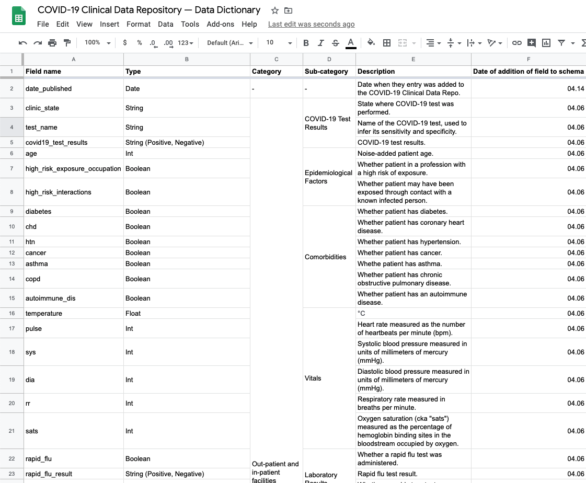
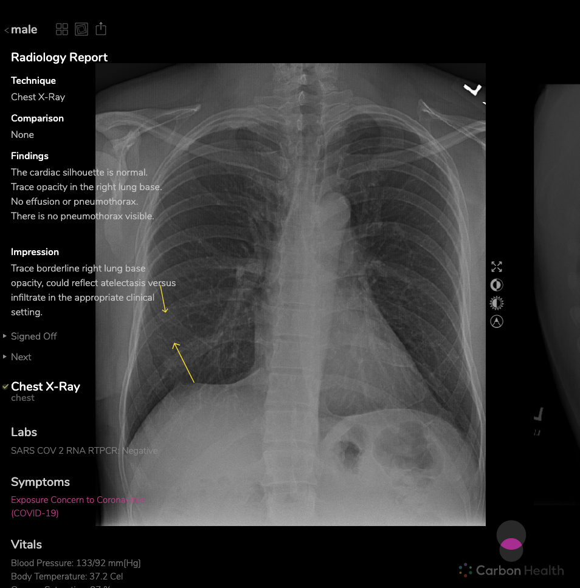

# Coronavirus Disease 2019 (COVID-19) Clinical Data Repository

This is an effort to compile a repository of the clinical characteristics of COVID-19 tested patients. By sharing our schema and data, we hope that we can 1) accelerate information sharing among frontline healthcare providers and 2) facilitate studies on COVID-19 signs, symptoms, stages, and care plans.

## Data

The repository is maintained as [CSVs](https://github.com/mdcollab/covidclinicaldata/tree/master/data/carbonhealth_and_braidhealth) and in <a href="https://docs.google.com/spreadsheets/d/11IuOqJ_L0wYcbDqovmDaASR2aae79I5a9wpGVOuQ9bU/edit?usp=sharing" target="_blank">Google Sheets</a> and is compliant with [HIPAA Privacy Rule's De-Identification Standard](https://www.hhs.gov/hipaa/for-professionals/privacy/special-topics/de-identification/index.html#standard). Here are some important details about the refresh cadence and organization of the repository:

  * Each row contains the clinical characteristics of a patient who has taken the COVID-19 test.  
  * Data from our contributors, Carbon Health, and Braid Health is compiled and published weekly.
  * Each batch is published as a separate CSV file (and Google Sheets tab).  
  * Each filename is prefixed with the date (mm-dd) the query was run, which matches the `date_published` field. 
  * Each batch contains a week's worth of test results, the last date being `date_published - 1`. The first batch, prefixed with 04-07, contains data since 03-07.
  * Additional details about each field are available in the [data dictionary](https://docs.google.com/spreadsheets/d/1p9rtv2LjVCPb54MdGe8ZqJ1zF3McIFnzq-ZhhjWgguI/edit?usp=sharing). 

## <a name="contribs"></a> Contributors and Supporters

### Data Contributors

#### Carbon Health — Clinical characteristics and laboratory findings

- Website: <a href="https://carbonhealth.com/coronavirus" target="_blank">Carbon Health</a>
- Twitter: <a href="https://twitter.com/CarbonHealth" target="_blank">@CarbonHealth</a>
- Email: <covidclinicaldata@carbonhealth.com>
- Notes: 
    * Carbon Health began COVID-19 testing with the SARS-CoV-2 RNA RT-PCR test on 03-04-20. 
    * The data includes **clinical characteristics** in addition to **radiological** and **laboratory** findings. It does not include **treatment plans**, **complications**, and **clinical outcomes**, which is collected at in-patient facilities.
    * The data includes both positive- and negative-tested patient characteristics. These include the characteristics of symptomatic patients, those in professions with a high risk of exposure, and/or those who may have been exposed through contact with a known infected person. 
    * Clinician-assessed symptoms are sparse for data published on 04-07 due to some criteria having been added later. 
    * A patient's reported age differs from their actual age by a reasonable randomized amount to protect their privacy. 
    
|  |  |
|:--:| :--: |
| Carbon Health Logo | [Data Dictionary](https://docs.google.com/spreadsheets/d/1p9rtv2LjVCPb54MdGe8ZqJ1zF3McIFnzq-ZhhjWgguI/edit?usp=sharing) |

#### Braid Health — Chest x-rays, findings, and clinician impressions

- Website: <a href="https://braid.health/www" target="_blank">Braid Health</a>
- Twitter: <a href="https://twitter.com/BraidHealth" target="_blank">@BraidHealth</a>
- Email: <vivian@braid.health> and <k@braid.health>
- Notes:
    * The data is merged with Carbon Health clinical characteristics and includes findings, clinician impressions, and links to chest x-rays. 
    * The links direct to the Braid Health website. The website UI allows for closer inspection by researchers and radiologists. 
    * The images can be downloaded for image processing and classification studies.

|  |   |
|:--:| :--:| 
| Braid Health Logo | [Sample Chest X-ray](https://braid.health/viewer/study/6905c8c988d201379dd932fa5ba650125d89bc5bddfa6a4df9f4338cbd2326f2?key=BIo8HvL8W_dy__4IdBFd1pxP3xoibTLfRwG4ErLo9Okog3RzXmcB0VJL-7onLz9PlL4OpSzut_hzZZGPnC6LX0&lab=sars) |

### Supporters

Special thanks to <a href="https://braid.health/www" target="_blank">Kevin Quennesson</a>, <a href="https://profiles.stanford.edu/nigam-shah" target="_blank">Nigam Shah</a>, and [Andrew Therriault](https://www.andrewtherriault.com/) for their support of this effort and for their feedback.

## Call for Data 

To ensure this data is representative of cases with varying severity levels and symptoms, we are requesting data from **out-patient test centers** and **in-patient healthcare facilities** which are treating COVID-19. 
Please use the templates below and email the data to <covidclinicaldata@carbonhealth.com>. 

Details about the fields are available in the [data dictionary](https://docs.google.com/spreadsheets/d/1p9rtv2LjVCPb54MdGe8ZqJ1zF3McIFnzq-ZhhjWgguI/edit?usp=sharing).

### Out-patient Test Centers

Out-patient test centers and clinics can contribute their data using the <a href="https://docs.google.com/spreadsheets/d/18dGt8lZQsaAL0X4OPDICWVU2LtTBhRQufR2eBcLVgPA/edit?usp=sharing" target="_blank">out-patient template</a>.

### In-patient Healthcare Facilities

In-patient healthcare providers can contribute additional columns for **treatment plans**, **complications**, and **clinical outcomes** using the <a href="https://docs.google.com/spreadsheets/d/18dGt8lZQsaAL0X4OPDICWVU2LtTBhRQufR2eBcLVgPA/edit?usp=sharing" target="_blank">in-patient template</a>.

## Citation

Please share any studies on this data via email or a <a href="https://github.com/mdcollab/covidclinicaldata" target="_blank">pull request</a>. 
You can use the format below to cite the data repository in your studies, remembering to update your date of access.

```
@dataset{2020covidclinicaldata,
  author =       {Carbon Health and Braid Health},
  title =        {Coronavirus Disease 2019 (COVID-19) Clinical Data Repository},
  howpublished = {Accessed on yyyy-mm-dd from \url{https://covidclinicaldata.com/}},
  year =         2020,
  version =      {2.0}
}
```

## Data Sharing Agreement

This work is licensed under a <a rel="license" href="http://creativecommons.org/licenses/by-nc-sa/4.0/">Creative Commons Attribution-NonCommercial-ShareAlike 4.0 International License</a>.

<a rel="license" href="http://creativecommons.org/licenses/by-nc-sa/4.0/"></a>


